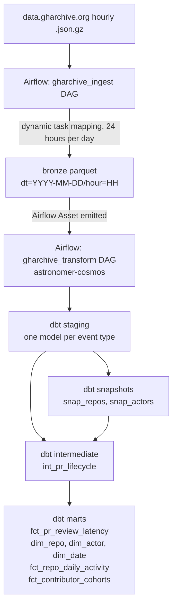

# Architecture

## Ingestion (bronze)

`gharchive_ingest` is a daily DAG (`@daily`, `catchup=True`) that dynamically
maps 24 tasks, one per hour of the logical date, rather than scheduling
hourly. A daily DAG produces about 365 DAG runs a year; an hourly DAG would
produce about 8,760. Airflow's scheduler and metadata database overhead scale
with DAG run count more than with task count within a run, so daily-with-24-
mapped-tasks is cheaper to operate at backfill scale without changing what
gets processed.

Each mapped task downloads one hour, validates the gzip is not truncated,
and writes to a hive-partitioned parquet path (`bronze/dt=.../hour=.../`) via
write-to-temp-then-atomic-rename, so a crashed or retried task never leaves a
partially written partition visible to readers. This is what makes
re-running a historical date safe: readers either see the old partition or
the fully-written new one, never a partial one.

A `gharchive_download_pool` Airflow pool caps concurrent hour downloads at 8
regardless of how many DAG runs are active simultaneously, so a large
backfill does not turn into a burst of concurrent requests against a public,
rate-limit-sensitive source.

404 responses are terminal and expected: some hours in 2011-2012 are genuinely
missing from the archive. These are recorded in a `missing_hours` control
table with a `reason` column and the task succeeds. Everything else that can
go wrong (timeout, 5xx, truncated gzip) is retried with exponential backoff
and only recorded as `missing_hours` if retries are exhausted with a non-404
reason, distinguishing "this hour will never exist" from "this attempt
failed."

Bronze keeps `payload` as an unparsed JSON string ([ADR 001](docs/decisions/001-bronze-payload-as-json.md)).
Only the columns shared by every event (`id`, `type`, `actor`, `repo`, `org`,
`created_at`) are typed at ingest time.

## Staging (silver)

One dbt model per event type of interest, each responsible for unnesting its
own `payload` shape and deduplicating on event `id`
([ADR 002](docs/decisions/002-dedupe-strategy.md)). Staging models are views:
they are cheap to keep in sync with bronze and do not require a separate
materialization step to pick up newly landed partitions.

## Snapshots

`snap_repos` and `snap_actors` are SCD2 snapshots keyed on the stable numeric
GitHub id, tracking the login/name over time. Repos get renamed and
transferred between orgs; actors get renamed. Any mart that joins on a
name instead of an id will silently misattribute history across a rename.

## Intermediate

`int_pr_lifecycle` is the one incremental model in the project and the one
that carries the spine metric's hard part: a PR opened in one partition can
receive its first review in a much later one. See
[ADR 003](docs/decisions/003-incremental-lookback.md) for the lookback window
design.

## Marts (gold)

`fct_pr_review_latency` is the spine metric, sliced by repo and year.
`dim_repo`, `dim_actor`, `dim_date` are the shared dimensions. Secondary
marts (`fct_repo_daily_activity`, `fct_contributor_cohorts`) are derived from
the same staging/intermediate layer and exist only because they are cheap
once the spine is built, not because they were independently planned.

## Targets

DuckDB is the only target where incremental logic is developed and tested;
it has no restrictions on DML. BigQuery is treated as a second target that
the same dbt project can compile against, constrained by the BigQuery
Sandbox's lack of DML support (see the BigQuery section of the README).
