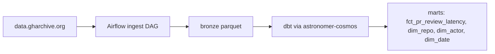

# gharchive-analytics

[](https://github.com/Yunhu-So/gharchive-analytics/actions/workflows/ci.yml)

Batch pipeline over GH Archive (the public GitHub event stream). One metric
drives the whole project: the time from a pull request opened by a
first-time contributor to a repository, to that PR's first human (non-bot)
review or review comment, sliced by repository and year. Everything else in
the schema exists to support that metric or is a cheap derivative of the same
staging layer.

## Architecture



See [ARCHITECTURE.md](ARCHITECTURE.md) for the layer-by-layer breakdown.

## Setup

```
git clone <repo>
cd gharchive-analytics
make setup
make run
```

`make run` starts Postgres and Airflow via docker compose and unpauses
`gharchive_ingest`. The DAG is `catchup=True` from 2015-01-01, so unpausing
it starts a real backfill toward the present day, not a one-off demo run —
that is by design (see the build brief), but it means a fresh `make run`
will keep downloading for a long time unless you pause it
(`airflow dags pause gharchive_ingest`) once you've seen enough days
succeed, or run a bounded window instead:

```
make backfill START=2015-01-01 END=2015-01-31
```

No manual console interaction is required for the DuckDB path either way.

## BigQuery (prod target)

The default assumption is a BigQuery Sandbox project (no billing account
attached). The sandbox does not support DML, so `dbt run` on the `prod`
target materializes incremental models as plain tables unless
`--vars '{bq_allow_dml: true}'` is set, in which case they switch to a real
`insert_overwrite` incremental strategy with `partition_by`. All incremental
logic is developed and tested against DuckDB, where there is no such
restriction. Terraform in `terraform/` provisions the datasets; no project
has been provisioned against it yet, so the bytes-scanned-before/after
measurement this section calls for is still outstanding.

Sandbox tables auto-expire after 60 days.

## Caveats

- Marts are scoped to 2015-01-01 onward; see
  [ADR 004](docs/decisions/004-schema-evolution.md) for the pre-2015 Timeline
  API schema break, and its one-month adapter demonstration for 2014-06.
- Event type coverage is not uniform across years; see
  [`docs/event_type_coverage.md`](docs/event_type_coverage.md), generated
  from the ingested data itself. `PullRequestReviewEvent` (formal GitHub PR
  reviews) genuinely does not appear until 2016 in the real data, since
  GitHub shipped that feature that year — a real instrumentation boundary,
  not a bug.
- Bot filtering combines a `[bot]` suffix rule with a curated seed list; see
  [ADR 005](docs/decisions/005-bot-filtering.md) for its known false-negative
  rate.
- "First-time contributor" is defined relative to the observed data window.
  Contributors active before the backfill start are misclassified as
  first-time; affected rows carry an uncertainty flag
  (`is_first_contributor_uncertain`).
- The Timeline API demo's synthetic event id hashes `created_at`, `actor`,
  `url`, and the payload together; a handful of truly identical near-
  duplicate events can still collide (see ADR 004).

## Backfill status

The ingest DAG ran against the real `data.gharchive.org` source (not a
fixture) from 2015-01-01, and was deliberately capped once it comfortably
passed 100M real ingested events rather than run an open-ended multi-year
backfill. That scope was a conscious choice, not a limitation reached by
accident: 100M+ events is enough real volume to prove the pipeline's
correctness and surface genuine scale problems (see the bugs below), without
the several-hundred-GB footprint a full 2015&ndash;2017 run would need on a
single laptop. `gharchive_ingest` is paused at this point; nothing about the
DAG, the pool, or the atomic-write logic changes if it were unpaused and
pointed at a longer window later.

Final numbers:

| metric | value |
|---|---|
| days successfully ingested | 261 (2015-01-01 through 2015-09-18) |
| events ingested | 143,162,505 |
| bronze size on disk | ~95 GB |
| genuine missing hours (real 404s) | 0 — GH Archive has no gaps in this range |
| wall-clock, active ingestion | ~6 hours (excludes a deliberate mid-run pause) |

The pipeline, dbt build, and tests are all verified against this data (see
the PR history for the bugs that surfaced and were fixed along the way: a
DuckDB parameterized-path bug, an Airflow scheduler fork/thread deadlock, a
JWT secret mismatch between containers, and a DuckDB query-planner OOM,
none of which were visible running dbt or pytest in isolation &mdash; only
the live pipeline at real scale caught them).

## What I'd do differently at scale

- Use a real object store (S3/GCS) for bronze instead of a local bind mount;
  the Docker Desktop VM on macOS is a real bottleneck for sustained
  multi-year backfills, independent of network speed.
- Partition the `missing_hours` and control tables the same way bronze is
  partitioned, rather than a single DuckDB file, once the backfill spans
  years instead of weeks.
- Revisit the Timeline API adapter's synthetic id if it were ever promoted
  beyond a demo: hashing is a reasonable stopgap for one month, not a
  substitute for a real identity scheme over years of data.
