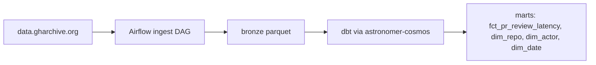

# gharchive-analytics

[](https://github.com/REPLACE_ME/gharchive-analytics/actions/workflows/ci.yml)

Batch pipeline over GH Archive (the public GitHub event stream). One metric
drives the whole project: the time from a pull request opened by a
first-time contributor to a repository, to that PR's first human (non-bot)
review or review comment, sliced by repository and year. Everything else in
the schema exists to support that metric or is a cheap derivative of the same
staging layer.

## Architecture



See [ARCHITECTURE.md](ARCHITECTURE.md) for the layer-by-layer breakdown.

## Setup

```
git clone <repo>
cd gharchive-analytics
make setup
make run
```

`make run` starts Postgres and Airflow via docker compose, unpauses the two
DAGs, and triggers an ingest run. No manual console interaction is required
for the DuckDB path.

## BigQuery (prod target)

The default assumption is a BigQuery Sandbox project (no billing account
attached). The sandbox does not support DML, so `dbt run` on the `prod`
target materializes incremental models as plain tables unless
`--vars '{bq_allow_dml: true}'` is set, in which case they switch to a real
`insert_overwrite` incremental strategy with `partition_by`. All incremental
logic is developed and tested against DuckDB, where there is no such
restriction.

Sandbox tables auto-expire after 60 days.

## Caveats

- Marts are scoped to 2015-01-01 onward; see
  [ADR 004](docs/decisions/004-schema-evolution.md) for the pre-2015 Timeline
  API schema break.
- Event type coverage is not uniform across years; see
  `docs/event_type_coverage.md`. Time series marts are restricted to windows
  with continuous coverage for their constituent event types.
- Bot filtering combines a `[bot]` suffix rule with a curated seed list; see
  [ADR 005](docs/decisions/005-bot-filtering.md) for its known false-negative
  rate.
- "First-time contributor" is defined relative to the observed data window.
  Contributors active before the backfill start are misclassified as
  first-time; affected rows carry an uncertainty flag.

## Status

This project is being built phase by phase per the build brief. Real numbers
(row counts, backfill wall-clock, bytes-scanned before/after BigQuery
partitioning) will be filled in here as each phase completes and is verified;
this section is intentionally not pre-filled with placeholder figures.

## What I'd do differently at scale

TBD once the backfill and BigQuery phases are complete.
